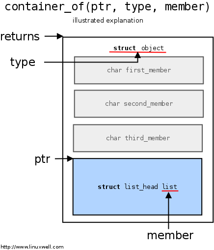

# Linux 内核链表及其应用

链表是一种常用的组织有序数据的数据结构，它通过指针将一系列数据节点连接成一条数据链，
是线性表的一种重要实现方式。有更好的动态性，建立链表时无需预先知道数据总量，可以随机分配空间，
可以高效地在链表中的任意位置实时插入或删除数据。链表的开销主要是**访问的顺序性和组织链的空间损失**。

使用链表的情况是： **遍历所有数据**或者**需要动态加入和删除数据**

## 单链表， 双链表 和 循环链表

Linux 内核中使用了很多数据结构，关于链表内核就是提供了**单链表，双链表 和哈希表**

- 单链表：
	单链表代码在 include/linux/llist.h 和 lib/llist.c 中。内核巧妙的使用 CPU  提供的 cmpxchg 指令实现了一个无锁的单链表
- 双链表
	双链表操作函数都在 include/linux/list.h
- 哈希表
	哈希表使用双链表，具体代码在： include/linux/list.h

这篇文章主要介绍了 Linux 双链表

### 1. 通常一个单链表的结构体如下所示

```c
struct list {
    void *data;         /* 指向链表数据 */
    struct list *next;  /* 指向下一个结点 */
};
```

单链表的示意图如下：


### 2. 通常一个双链表的结构体如下所示

```c
struct list {
    void *data;         /* 指向链表数据 */
    struct list *next;  /* 指向下一个结点 */
    struct list *prev;  /* 指向上一个结点 */
};
```

双链表的示意图如下：


### 3. 循环链表

循环链表的示意图如下：


循环链表是一种特殊的单链表。它跟单链表唯一的区别就在尾结点。
单链表的尾结点指针指向空地址, 而循环链表的尾结点指针是指向链表的头结点。

## Linux 内核的实现

在Linux内核中使用了大量的链表结构来组织数据，包括设备列表以及各种功能模块中的数据组织。这些链表大多采用在
**include/linux/list.h**

相对于通常的链表实现的方法，Linux内核的实现很有意思。通常的链表实现是通过在数据结构体内部添加一个指向数据的
next/prev 结点指针，使得数据链接起来，形成链表的。

Linux内核的实现方式与众不同，并不是在数据结构中添加链表，而是把链表当成一个数据类型添加到数据结构中的。Linux内核
链表是怎么实现的呢，下面我们一步一步进行解读：

### 1. 内核链表的数据结构

Linux内核链表的代码放在 **include/linux/list.h**， 感兴趣的同学可以查看

链表的声明在 **include/linux/types.h** 中：

```c
struct list_head {
        struct list_head *next, *prev;
};
```

有了这个定义我们该怎么使用呢？假如我们有一个 book 结构体，想把所有的制作一个列表清单则可简单定义如下：

```c
struct book {
    int id;                 /* 书的 ID */
    struct list_head list;  /* 所有 book 结构体形成的链表 */
}
```

好了我们有了一个可以使用的链表结构体，但是还是需要一些链表的操作方法才可以使用它，内核已经为我们提供好了
一套完整操作链表的方法 list_add(), list_del(), list_swap(), list_empty() 等。这些链表操作函数有一个
特点就是：参数都是 **struct list_head** 类型的指针

### 2. 访问数据

Linux链表中仅保存了数据项结构中 list_head 成员变量的地址，那么我们如何通过这个 list_head 成员访问到
作为它的所有者的节点数据呢？

Linux为此提供了一个 **list_entry(ptr, type, member)** 宏:

- ptr 是指向该数据中list_head成员的指针，也就是存储在链表中的地址值
- type 是数据项的类型
- member 则是数据项类型定义中list_head成员的变量名

```c
#define offsetof(TYPE, MEMBER)  ((size_t)&((TYPE *)0)->MEMBER)

/* container_of 定义在 include/linux/kernel.h中 */
/**
 * container_of - cast a member of a structure out to the containing structure
 * @ptr:        the pointer to the member.
 * @type:       the type of the container struct this is embedded in.
 * @member:     the name of the member within the struct.
 *
 */
#define container_of(ptr, type, member) ({                              \
        void *__mptr = (void *)(ptr);                                   \
        ((type *)(__mptr - offsetof(type, member))); })

/**
 * list_entry - get the struct for this entry
 * @ptr:        the &struct list_head pointer.
 * @type:       the type of the struct this is embedded in.
 * @member:     the name of the list_head within the struct.
 */
#define list_entry(ptr, type, member) \
        container_of(ptr, type, member)
```

list_entry 宏定义转到了 container_of, container_of在Linux内核中是一个常用的宏
这个宏的用途就是：已知一个结构体的成员变量的首地址，进而获得整个结构体变量的首地址

先来分析下代码 **offsetof** 是将 0 地址强转换为 TYPE * 类型，然后取的成员 MEMBER 的地址。因为起始地址为0，
MEMBER 的地址就是该成员在 TYPE 结构体中的偏移地址。所以这个宏的意思就是： 获取 MEMBER 在 TYPE 中的偏移量

再看 container_of 的第一条语句把 ptr 强制转换为 void * 类型，是为了便于减去该地址在结构体的偏移量。
第二语句就是把当前指向的地址减去所在结构体的偏移量就得到了，要求的结构体的地址，最后强制类型转换

可以结合下图进行学习



**引用图:**[The Magical container_of() Macro ](https://radek.io/2012/11/10/magical-container_of-macro/)

### 3. 链表操作

下面来看链表的操作: 这些函数的复杂度都是 O(1) 的

#### 1) 初始化节点

- LIST_HEAD 的作用是定义表头(节点)：新建双向链表表头name，并设置name的前继节点和后继节点都是指向name本身。
- LIST_HEAD_INIT 的作用是初始化节点：设置name节点的前继节点和后继节点都是指向name本身。
- INIT_LIST_HEAD 和 LIST_HEAD_INIT 一样，是初始化节点：将list节点的前继节点和后继节点都是指向list本身。

我们刚开始定义的一个 book 结构体可以这样使用：
    static LIST_HEAD(book_list);

```c
/*
 * Simple doubly linked list implementation.
 *
 * Some of the internal functions ("__xxx") are useful when
 * manipulating whole lists rather than single entries, as
 * sometimes we already know the next/prev entries and we can
 * generate better code by using them directly rather than
 * using the generic single-entry routines.
 */

#define LIST_HEAD_INIT(name) { &(name), &(name) }

#define LIST_HEAD(name) \
	struct list_head name = LIST_HEAD_INIT(name)

static inline void INIT_LIST_HEAD(struct list_head *list)
{
	list->next = list;
	list->prev = list;
}
```

#### 2) 添加节点

- __list_add(new, prev, next) 的作用是添加节点：将new插入到prev和next之间。在linux中，以"__"开头的函数是内核的内部使用
- list_add(new, head) 的作用是添加new节点：将new添加到head之后，是new称为head的后继节点。
- list_add_tail(new, head) 的作用是添加new节点：将new添加到head之前，即将new添加到双链表的末尾。

有一个book
    list_add(&book->list, &book_list);

```c
static inline void __list_add(struct list_head *new,
			      struct list_head *prev,
			      struct list_head *next)
{
	next->prev = new;
	new->next = next;
	new->prev = prev;
	prev->next = new;
}

static inline void list_add(struct list_head *new, struct list_head *head)
{
	__list_add(new, head, head->next);
}

static inline void list_add_tail(struct list_head *new, struct list_head *head)
{
	__list_add(new, head->prev, head);
}
```

#### 3) 删除节点

```c
static inline void __list_del(struct list_head * prev, struct list_head * next)
{
	next->prev = prev;
	prev->next = next;
}


static inline void __list_del_entry(struct list_head *entry)
{
	__list_del(entry->prev, entry->next);
}

static inline void list_del(struct list_head *entry)
{
	__list_del_entry(entry);
	entry->next = LIST_POISON1;
	entry->prev = LIST_POISON2;
}
```

#### 4) 替换节点

```c
/**
 * list_replace - replace old entry by new one
 * @old : the element to be replaced
 * @new : the new element to insert
 *
 * If @old was empty, it will be overwritten.
 */
static inline void list_replace(struct list_head *old,
				struct list_head *new)
{
	new->next = old->next;
	new->next->prev = new;
	new->prev = old->prev;
	new->prev->next = new;
}

/**
 * list_swap - replace entry1 with entry2 and re-add entry1 at entry2's position
 * @entry1: the location to place entry2
 * @entry2: the location to place entry1
 */
static inline void list_swap(struct list_head *entry1,
			     struct list_head *entry2)
{
	struct list_head *pos = entry2->prev;

	list_del(entry2);
	list_replace(entry1, entry2);
	if (pos == entry1)
		pos = entry2;
	list_add(entry1, pos);
}
```

#### 5）获取节点

```c
#define list_entry(ptr, type, member) \
	container_of(ptr, type, member)

#define list_first_entry(ptr, type, member) \
	list_entry((ptr)->next, type, member)

#define list_last_entry(ptr, type, member) \
	list_entry((ptr)->prev, type, member)

#define list_next_entry(pos, member) \
	list_entry((pos)->member.next, typeof(*(pos)), member)

```

#### 6) 遍历节点

```c
/**
 * list_for_each	-	iterate over a list
 * @pos:	the &struct list_head to use as a loop cursor.
 * @head:	the head for your list.
 */
#define list_for_each(pos, head) \
	for (pos = (head)->next; pos != (head); pos = pos->next)

/**
 * list_for_each_safe - iterate over a list safe against removal of list entry
 * @pos:	the &struct list_head to use as a loop cursor.
 * @n:		another &struct list_head to use as temporary storage
 * @head:	the head for your list.
 */
#define list_for_each_safe(pos, n, head) \
	for (pos = (head)->next, n = pos->next; pos != (head); \
		pos = n, n = pos->next)

/**
 * list_for_each_entry	-	iterate over list of given type
 * @pos:	the type * to use as a loop cursor.
 * @head:	the head for your list.
 * @member:	the name of the list_head within the struct.
 */
#define list_for_each_entry(pos, head, member)				\
	for (pos = list_first_entry(head, typeof(*pos), member);	\
	     &pos->member != (head);					\
	     pos = list_next_entry(pos, member))
```

## Linux 内核链表的应用

### 内核实列

下面编写一个linux 内核模块，用以创建、增加、删除和遍历链表

```c
#include <linux/kernel.h>
#include <linux/module.h>
#include <linux/slab.h>
#include <linux/list.h>

#define N	8	/* 链表节点 */

struct book_list {
	int id;			/* 数据 */
	struct list_head list;	/* 指向双联表前后节点的指针 */
};

struct book_list book_head; /* 头节点 */

static int __init list_test_init(void)
{
	struct book_list *node;	/* 每次申请链表节点时所用的指针 */
	struct list_head *pos;
	struct book_list *p;
	int i;

	printk("%s is starting...\n", __func__);
	INIT_LIST_HEAD(&book_head.list);

	/* 建立N个节点，依次加入到链表当中 */
	for (i = 0; i < N; i++) {
		/* kmalloc（）在内核空间申请内存，类似于malloc,参见第四章 */
		node = (struct book_list *)kmalloc(sizeof(struct book_list), GFP_KERNEL); 
		node->id = i+1;
		list_add_tail(&node->list, &book_head.list);
		printk("Node %d has added to the list_test...\n", i+1);
	}

	/* 遍历链表 */
	i = 1;
	list_for_each(pos, &book_head.list) {
		p = list_entry(pos, struct book_list, list);
		printk("Node %d's data:%d\n", i, p->id);
		i++;
	}

	return 0;
}

static void __exit list_test_exit(void)
{
	struct list_head *pos, *n;
	struct book_list *p;
	int i = 1;

	/* 依次删除N个节点, 为了安全删除节点而进行的遍历 */
	list_for_each_safe(pos, n, &book_head.list) {
		list_del(pos);
		p = list_entry(pos, struct book_list, list);
		kfree(p);
		printk("Node %d has removed from the list_test...\n", i++);
	}
	printk("%s is exiting...\n", __func__);
}

module_init(list_test_init);
module_exit(list_test_exit);

MODULE_LICENSE("GPL");
MODULE_AUTHOR("TEST");
```

```makefile
obj-m  := list.o
KDIR	:= /lib/modules/`uname -r`/build

all:
	make -C $(KDIR) M=$$PWD

clean:
	make -C $(KDIR) M=$$PWD clean
```

### 安全性考虑

在并发执行的环境下，链表操作通常都应该考虑同步安全性问题，为了方便，Linux将这一操作留给应用自己处理。
Linux链表自己考虑的安全性主要有两个方面：

1. 链表为空的判断

内核提供了2个函数来判断链表是否为空

	list_empty()  只是通过**头指针的next是否指向自己**来判断链表是否为空
	list_empty_careful() 同时判断头指针的next和prev，仅当两者都指向自己时才返回真

添加安全操作主要是为了解决调用该函数时操作链表导致 next和prev 不一致的情况

2. 遍历链表时删除节点

链表在遍历的时候，都是通过移动pos指针来遍历整个链表。但如果在遍历的操作的时候，有一个删除 pos 指向的节点的操作，
pos 指针的移动就会停止，因为 list_del(pos) 将把 pos 的 next、prev 置成 LIST_POSITION1 和 LIST_POSITION2 的特殊值。

所以内核又添加了两个遍历操作的"_safe"接口：list_for_each_safe(pos, n, head)、list_for_each_entry_safe(pos, n, head, member)，
这两个接口要求调用者另外提供一个与 pos 同类型的指针 n，在for循环中暂存pos下一个节点的地址，避免因pos节点被释放而造成的中断
